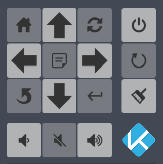

# Kodi Remote Card



```yaml      - type: picture-elements
        image: /local/banners/empty_long_placeholder.png
        elements:

          - type: image
            image: /local/icons/animated/media-card/up-arrow.png
            tap_action: call-service
            service: shell_command.kodi_up
            style:
              top: 5em
              left: 10em
              width: 54px
              height: 54px
              background-color: rgb(255, 255, 255, 0.8)
              filter: invert(0.20)
              border-radius: 4px
              z-index: 2
          - type: image
            image: /local/icons/animated/media-card/home-button.png
            tap_action: call-service
            service: shell_command.kodi_home
            style:
              top: 5em
              left: 6em
              width: 24px
              height: 24px
              padding: 15px
              background-color: rgb(200, 200, 200, 0.5)
              filter: invert(0.20)
              border-radius: 4px
              z-index: 2
          - type: image
            image: /local/icons/animated/media-card/update-button.png
            tap_action: call-service
            service: shell_command.kodi_update
            style:
              top: 5em
              left: 14em
              width: 24px
              height: 24px
              padding: 15px
              background-color: rgb(200, 200, 200, 0.5)
              filter: invert(0.20)
              border-radius: 4px
              z-index: 2
          - type: image
            image: /local/icons/animated/media-card/poweroff-button.png
            tap_action: call-service
            service: shell_command.kodi_power
            style:
              top: 5em
              left: 19em
              width: 24px
              height: 24px
              padding: 15px
              background-color: rgb(255, 255, 255, 0.8)
              filter: invert(0.20)
              border-radius: 4px
              z-index: 2
          - type: image
            image: /local/icons/animated/media-card/left-arrow.png
            tap_action: call-service
            service: shell_command.kodi_left
            style:
              top: 9em
              left: 6em
              width: 54px
              height: 54px
              background-color: rgb(255, 255, 255, 0.8)
              filter: invert(0.20)
              border-radius: 4px
              z-index: 2
          - type: image
            image: /local/icons/animated/media-card/context-button.png
            tap_action: call-service
            service: shell_command.kodi_context
            style:
              top: 9em
              left: 10em
              width: 24px
              height: 24px
              padding: 15px
              background-color: rgb(200, 200, 200, 0.5)
              filter: invert(0.20)
              border-radius: 4px
              z-index: 2
          - type: image
            image: /local/icons/animated/media-card/right-arrow.png
            tap_action: call-service
            service: shell_command.kodi_right
            style:
              top: 9em
              left: 14em
              width: 54px
              height: 54px
              background-color: rgb(255, 255, 255, 0.8)
              filter: invert(0.20)
              border-radius: 4px
              z-index: 2
          - type: image
            image: /local/icons/animated/media-card/reboot-button.png
            tap_action: call-service
            service: shell_command.kodi_restart
            style:
              top: 9em
              left: 19em
              width: 24px
              height: 24px
              padding: 15px
              background-color: rgb(200, 200, 200, 0.5)
              filter: invert(0.20)
              border-radius: 4px
              z-index: 2
          - type: image
            image: /local/icons/animated/media-card/down-arrow.png
            tap_action: call-service
            service: shell_command.kodi_down
            style:
              top: 13em
              left: 10em
              width: 54px
              height: 54px
              background-color: rgb(255, 255, 255, 0.8)
              filter: invert(0.20)
              border-radius: 4px
              z-index: 2
          - type: image
            image: /local/icons/animated/media-card/clean-button.png
            tap_action: call-service
            service: shell_command.kodi_clean
            style:
              top: 13em
              left: 19em
              width: 24px
              height: 24px
              padding: 15px
              background-color: rgb(255, 255, 255, 0.8)
              filter: invert(0.20)
              border-radius: 4px
              z-index: 2
          - type: image
            image: /local/icons/animated/media-card/back-button.png
            tap_action: call-service
            service: shell_command.kodi_back
            style:
              top: 13em
              left: 6em
              width: 24px
              height: 24px
              padding: 15px
              background-color: rgb(200, 200, 200, 0.5)
              filter: invert(0.20)
              border-radius: 4px
              z-index: 2
          - type: image
            image: /local/icons/animated/media-card/enter-button.png
            tap_action: call-service
            service: shell_command.kodi_enter
            style:
              top: 13em
              left: 14em
              width: 24px
              height: 24px
              padding: 15px
              background-color: rgb(200, 200, 200, 0.5)
              filter: invert(0.20)
              border-radius: 4px
              z-index: 2
          - type: image
            image: /local/icons/animated/media-card/volumedown-button.png
            tap_action: call-service
            service: shell_command.kodi_volumedown
            style:
              top: 18em
              left: 6em
              width: 24px
              height: 24px
              padding: 15px
              background-color: rgb(255, 255, 255, 0.8)
              filter: invert(0.20)
              border-radius: 4px
              z-index: 2
          - type: image
            image: /local/icons/animated/media-card/mute-button.png
            tap_action: call-service
            service: shell_command.kodi_mute
            style:
              top: 18em
              left: 10em
              width: 24px
              height: 24px
              padding: 15px
              background-color: rgb(200, 200, 200, 0.5)
              filter: invert(0.20)
              border-radius: 4px
              z-index: 2
          - type: image
            image: /local/icons/animated/media-card/volumeup-button.png
            tap_action: call-service
            service: shell_command.kodi_volumeup
            style:
              top: 18em
              left: 14em
              width: 24px
              height: 24px
              padding: 15px
              background-color: rgb(255, 255, 255, 0.8)
              filter: invert(0.20)
              border-radius: 4px
              z-index: 2
          - type: image
            image: /local/icons/animated/media-card/kodi-icon.png
            entity: media_player.kodi
            style:
              top: 18em
              left: 19em
              width: 56px
              height: 56px
              z-index: 2
```

And then some shell_command to send commands to kodi

```yaml
kodi_clean: "kodi_remote --clean"
kodi_update: "kodi_remote --update"
kodi_up: "kodi_remote --up"
kodi_down: "kodi_remote --down"
kodi_left: "kodi_remote --left"
kodi_right: "kodi_remote --right"
kodi_enter: "kodi_remote --select"
kodi_home: "kodi_remote --home"
kodi_power: "kodi_remote --poweroff"
kodi_back: "kodi_remote --back"
```
and last but not least the little shell script that handles the calls obviously swap the ip address and port in the shell script for your ip and port

```bash
host=http://port:ip/jsonrpc
case $1 in
       --back ) curl -sS --data-binary '{ "jsonrpc": "2.0", "method": "Input.back", "id": "mybash"}' -H 'content-type: application/json;' $host ;;
         --up ) curl -sS --data-binary '{ "jsonrpc": "2.0", "method": "Input.Up", "id": "mybash"}' -H 'content-type: application/json;' $host ;;
       --down ) curl -sS --data-binary '{ "jsonrpc": "2.0", "method": "Input.Down", "id": "mybash"}' -H 'content-type: application/json;' $host ;;
       --left ) curl -sS --data-binary '{ "jsonrpc": "2.0", "method": "Input.Left", "id": "mybash"}' -H 'content-type: application/json;' $host ;;
      --right ) curl -sS --data-binary '{ "jsonrpc": "2.0", "method": "Input.Right", "id": "mybash"}' -H 'content-type: application/json;' $host ;;
       --home ) curl -sS --data-binary '{ "jsonrpc": "2.0", "method": "Input.Home", "id": "mybash"}' -H 'content-type: application/json;' $host ;;
     --select ) curl -sS --data-binary '{ "jsonrpc": "2.0", "method": "Input.Select", "id": "mybash"}' -H 'content-type: application/json;' $host ;;
     --update ) curl -sS --data-binary '{ "jsonrpc": "2.0", "method": "VideoLibrary.Scan", "id": "mybash"}' -H 'content-type: application/json;' $host ;;
      --clean ) curl -sS --data-binary '{ "jsonrpc": "2.0", "method": "VideoLibrary.Clean", "id": "mybash"}' -H 'content-type: application/json;' $hostc ;;
   --poweroff ) curl -sS --data-binary '{ "jsonrpc": "2.0", "method": "System.Shutdown", "id": "mybash"}' -H 'content-type: application/json;' $host ;;
    --restart ) curl -sS --data-binary '{ "jsonrpc": "2.0", "method": "System.OnRestart", "id": "mybash"}' -H 'content-type: application/json;' $host ;;
    --context ) curl -sS --data-binary '{ "jsonrpc": "2.0", "method": "Input.ContextMenu", "id": "mybash"}' -H 'content-type: application/json;' $host ;;
       --mute ) curl -sS --data-binary '{ "jsonrpc": "2.0", "method": "Application.SetMute", "params": {"mute":"toggle"}, "id": "mybash"}' -H 'content-type: application/json;' $host ;;
   --volumeup ) curl -sS --data-binary '{ "jsonrpc": "2.0", "method": "Application.SetVolume", "params": { "volume": "increment" }, "id": 1 }' -H 'content-type: application/json;' $host ;;
 --volumedown ) curl -sS --data-binary '{ "jsonrpc": "2.0", "method": "Application.SetVolume", "params": { "volume": "decrement" }, "id": 1 }' -H 'content-type: application/json;' $host ;;
 --test ) curl -sS --data-binary '{ "jsonrpc": "2.0", "method": "VideoLibrary.GetTVShows", "id": "mybash"}' -H 'content-type: application/json;' $host ;;
esac
```

here is the [iconpack](../.gitbook/assets/media-card-iconpack.zip) for this card 
