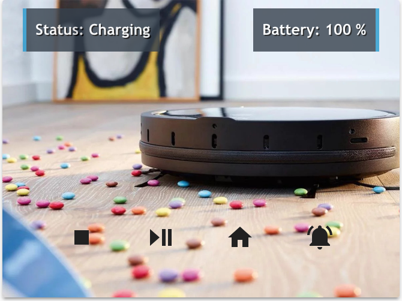

# Xiaomi Vacuum Card





This card uses these components that you also need to install:

* [component.Xiaomi Mi Vacuum](https://www.home-assistant.io/components/vacuum.xiaomi_miio/)





```yaml
  - type: picture-elements
    image: /local/vacuum_card.jpg
    elements:
    - type: icon
      icon: mdi:bell-ring
      tap_action: call-service
      entity: vacuum.xiaomi_vacuum_cleaner
      service: vacuum.locate
      style:
        top: 80%
        left: 80%
        "--paper-item-icon-color": rgb(115, 122, 130)

    - type: icon
      tap_action: call-service
      icon: mdi:home
      entity: vacuum.xiaomi_vacuum_cleaner
      service: vacuum.return_to_base
      style:
        top: 80%
        left: 60%
        "--paper-item-icon-color": rgb(115, 122, 130)

    - type: icon
      icon: mdi:play-pause
      tap_action: call-service
      entity: vacuum.xiaomi_vacuum_cleaner
      service: vacuum.start_pause
      style:
        top: 80%
        left: 40%
        "--paper-item-icon-color": rgb(115, 122, 130)

    - type: icon
      icon: mdi:stop
      tap_action: call-service
      entity: vacuum.xiaomi_vacuum_cleaner
      service: vacuum.stop
      style:
        top: 80%
        left: 20%
        "--paper-item-icon-color": rgb(115, 122, 130)

    - type: state-label
      entity: sensor.vacuum_status
      style:
        top: 10%
        left: 5%
        color: rgb(255, 255, 255)
        transform: translate(0%,-50%)
        pointer-events: none
        text-shadow: 1px 1px black
        font-family: Trebuchet MS
        font-size: 90%
        font-weight: bold
        border-left-style: solid
        border-color: rgb(34, 154, 210)
        background-color: rgb(54, 65, 78)
        opacity: 0.8

    - type: state-label
      entity: sensor.vacuum_battery
      style:
        top: 10%
        right: 5%
        color: rgb(255, 255, 255)
        transform: translate(0%,-50%)
        pointer-events: none
        text-shadow: 1px 1px black
        font-family: Trebuchet MS
        font-size: 90%
        font-weight: bold
        border-right-style: solid
        border-color: rgb(34, 154, 210)
        background-color: rgb(54, 65, 78)
        opacity: 0.8
```

Here is the package for the sensors


Change 'xiaomi_vacuum_cleaner' on the states for your robots name in the template sensors


```yaml
  - platform: template
    sensors:
      vacuum_status:
        friendly_name: "Vacuum - Status"
        value_template: "Status: {{ states.vacuum.xiaomi_vacuum_cleaner.attributes.status }}"


  - platform: template
    sensors:
      vacuum_battery:
        friendly_name: "Vacuum - Battery"
        value_template: "Battery: {{ states.vacuum.xiaomi_vacuum_cleaner.attributes.battery_level }}"
        device_class: battery
        unit_of_measurement: '%'
```


