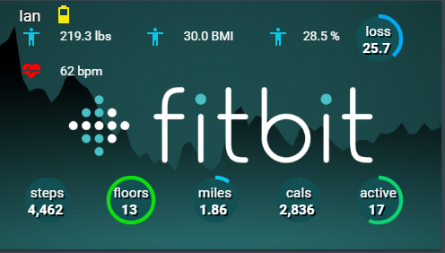

# Fitbit Card




This card requires you to install and setup the following components:


* [Fitbit](https://www.home-assistant.io/components/sensor.fitbit/)


```yaml
    - type: picture-elements
      image: /local/lovelace/icons/fitbit.png
      elements:
      - type: custom:circle-sensor-card
          entity: sensor.steps
          max: 10000
          min: 0
          stroke_width: 15
          gradient: true
          fill: '#125054'
          name: steps
          units: ' '
          font_style:
          font-size: 1.1em
          font-color: white
          text-shadow: '2px 2px black'
          color_stops:
          1: '#09C7E8'
          10000: '#0BDF0E'
          style:
          top: 70%
          left: 5%
          width: 4em
          height: 4em
          transform: none
      - type: custom:circle-sensor-card
          entity: sensor.floors
          max: 10
          min: 0
          stroke_width: 15
          gradient: true
          fill: '#125054'
          name: floors
          units: ' '
          font_style:
          font-size: 1.1em
          font-color: white
          text-shadow: '2px 2px black'
          color_stops:
          1: '#09C7E8'
          10: '#0BDF0E'
          style:
          top: 70%
          left: 24%
          width: 4em
          height: 4em
          transform: none
      - type: custom:circle-sensor-card
          entity: sensor.distance
          max: 10
          min: 0
          stroke_width: 15
          gradient: true
          fill: '#125054'
          name: miles
          units: ' '
          font_style:
          font-size: 1.1em
          font-color: white
          text-shadow: '2px 2px black'
          color_stops:
          1: '#09C7E8'
          10: '#0BDF0E' 
          style:
          top: 70%
          left: 43%
          width: 4em
          height: 4em
          transform: none
      - type: custom:circle-sensor-card
          entity: sensor.calories
          max: 3000
          min: 0
          stroke_width: 15
          gradient: true
          fill: '#125054'
          name: cals
          shadow: true
          units: ' '
          font_style:
          font-size: 1.1em
          font-color: white
          text-shadow: '2px 2px black'
          color_stops:
          1: '#09C7E8'
          3000: '#0BDF0E'
          style:
          top: 70%
          left: 62%
          width: 4em
          height: 4em
          transform: none
      - type: custom:circle-sensor-card
          entity: sensor.fitbit_minutes_active
          max: 30 
          min: 0
          stroke_width: 15
          gradient: true
          fill: '#125054'
          name: active
          units: ' '
          font_style:
          font-size: 1.1em
          font-color: white
          text-shadow: '2px 2px black'
          color_stops:
          1: '#09C7E8'
          30: '#0BDF0E'
          style:
          top: 70%
          left: 80%
          width: 4em
          height: 4em
          transform: none
      - type: custom:hui-markdown-card
          content: >
          Your Name
          style:
          top: 6%
          left: 1%
          font-size: 18px
          color: white
          text-shadow: -1px 0 black, 0 1px black, 1px 0 black, 0 -1px black 
          "--paper-card-background-color": none
          "--paper-material-elevation-1_-_box-shadow": none
          "--shadow-elevation-2dp_-_box-shadow": none
          transform: translate(0%,-50%)  
      - type: state-icon
          entity: sensor.weight
          title: Weight
          style:
          left: 3%
          top: 7%
          "--iron-icon-fill-color": '#09C7E8'
          transform: none
      - type: state-label
          entity: sensor.weight
          title: Weight
          style:
          left: 12%
          top: 8%
          color: white
          transform: none
      - type: state-icon
          entity: sensor.bmi
          title: BMI
          style:
          left: 31%
          top: 7%
          "--iron-icon-fill-color": '#09C7E8'
          transform: none
      - type: state-label
          entity: sensor.bmi
          title: BMI
          style:
          left: 40%
          top: 8%
          color: white
          transform: none
      - type: state-icon
          entity: sensor.body_fat
          title: Body Fat
          style:
          left: 59%
          top: 7%
          "--iron-icon-fill-color": '#09C7E8'
          transform: none
      - type: state-label
          entity: sensor.body_fat
          title: Body Fat
          style:
          left: 67%
          top: 8%
          color: white
          transform: none
      - type: image
          entity: sensor.ionic_battery
          title: Ionic Battery
          image: /local/lovelace/icons/battery_full.png
          state_image:
          "High": /local/lovelace/icons/battery_high.png
          "Medium": /local/lovelace/icons/battery_medium.png
          "Low": /local/lovelace/icons/battery_low.png
          style:
          left: 93%
          top: 8%
          transform: none
          width: 24px
          height: 24px
      - type: state-icon
          entity: sensor.resting_heart_rate
          title: Resting HR
          style:
          left: 3%
          top: 21%
          "--iron-icon-fill-color": red
          transform: none
      - type: state-label
          entity: sensor.resting_heart_rate
          title: Resting HR
          style:
          left: 12%
          top: 22%
          color: white
          transform: none
```


**Additional tips:**   
  
* Be sure to change "Your Name" in the markdown card to match the user's
* `sensor.resting_heart_rate` and `sensor.ionic_battery` are dependent on the Fitbit device you use and may not be available to you.



