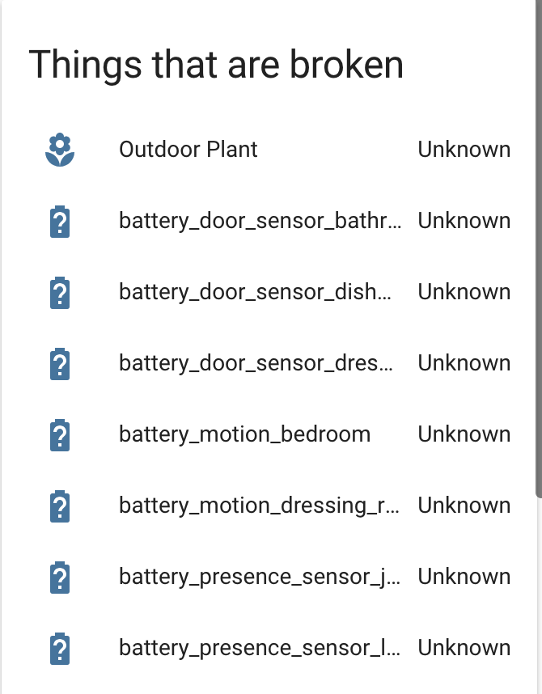

# Things That Are Probably Broken  Card


This requires you to have the following custom card setup

* [Monster Card](https://github.com/ciotlosm/custom-lovelace/tree/master/monster-card)





```yaml
  - type: custom:monster-card
    card:
      type: entities
      title: Things that are broken
      show_header_toggle: false
    filter:
      include:
        - state: "unknown"
      exclude:
        - entity_id: group.*
```

