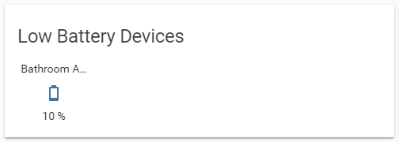

# Devices with low battery state


This requires you to have the following custom card setup

* [Monster Card](https://github.com/ciotlosm/custom-lovelace/tree/master/monster-card)





```yaml
      - type: custom:monster-card
        show_empty: false
        card:
          type: glance
          title: Low Battery Devices
        filter:
          include:
            - entity_id: "*battery_level*"
              state: '< 25'
            - attributes:
                battery: '< 25'
            - attributes:
                battery_level: '< 25'
```
