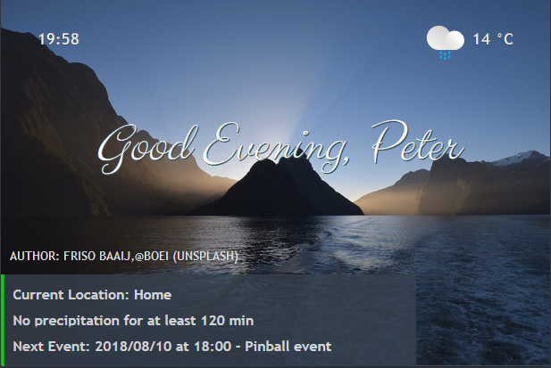

# Greeter Card

_A simple greeter card that changes the welcome message based on time of day, it also uses weather from minutecast with animated icons._



This card requires you to install and setup the following components:



* [Yahoo Weather](https://www.home-assistant.io/components/weather.yweather/)
* [Google Calendar](https://www.home-assistant.io/components/calendar.google/)



```yaml
    - type: picture-elements
      image: /local/banners/vacation.jpg
      elements:
        - type: state-label
          entity: sensor.time
          style:
            top: 8%
            left: 10%
            color: rgb(249, 251, 255)
            text-shadow: 2px 2px DarkSlateGrey
            font-family: Trebuchet MS
            font-weight: bold
            pointer-events: none
            text-rendering: optimizeLegibility
            -moz-osx-font-smoothing: grayscale
            font-smoothing: antialiased
            -webkit-font-smoothing: antialiased

        - type: state-icon
          entity: sensor.outside_temp
          style:
            top: 7.5%
            left: 82%
            pointer-events: none
            max-width: 24px
            max-height: 24px
            color: rgb(249, 251, 255)
        - type: state-label
          entity: sensor.outside_temp
          style:
            top: 8%
            left: 90%
            font-weight: bold
            color: rgb(249, 251, 255)
            font-family: Trebuchet MS
            text-shadow: 2px 2px DarkSlateGrey
            text-rendering: optimizeLegibility
            -moz-osx-font-smoothing: grayscale
            font-smoothing: antialiased
            -webkit-font-smoothing: antialiased

        - type: state-label
          entity: sensor.time_of_day
          style:
            top: 40%
            left: 50%
            color: rgb(249, 251, 255)
            font-size: 250%
            pointer-events: none
            text-shadow: 2px 2px DarkSlateGrey
            font-family: Trebuchet MS
            font-style: oblique
            font-weight: 400
            text-rendering: optimizeLegibility
            -moz-osx-font-smoothing: grayscale
            font-smoothing: antialiased
            -webkit-font-smoothing: antialiased

        - type: state-label
          entity: sensor.outside_alerts
          style:
            top: 52%
            left: 50%
            color: rgb(249, 251, 255)
            font-family: Trebuchet MS
            font-style: oblique
            text-shadow: 2px 2px DarkSlateGrey
            font-size: 120%
            pointer-events: none
            font-weight: 400
            text-rendering: optimizeLegibility
            -moz-osx-font-smoothing: grayscale
            font-smoothing: antialiased
            -webkit-font-smoothing: antialiased

        - type: state-label
          entity: sensor.greeter_card_info
          style:
            top: 82%
            left: 0%
            color: rgb(255, 255, 255)
            transform: none
            font-family: Trebuchet MS
            text-shadow: 2px 2px black
            font-size: 90%
            pointer-events: none
            font-weight: bold
            border-left-style: solid
            box-shadow: 0 4px 8px 0 rgba(0, 0, 0, 0.2), 0 6px 20px 0 rgba(0, 0, 0, 0.19)
            border-color: rgb(34, 154, 210)
            background-color: rgb(54, 65, 78)
            opacity: 0.8
```

Here are the package with sensors


Please change the following states on the follwing sensors

* greeter\_card\_info  
* time\_of\_day  


  ```yaml
  states('yourawesome_device_tracker')
  as_timestamp(states.calendar.your_awesome_mail.attributes.start_time)
  states.calendar.your_awesome_mail.attributes.message
  change User to wanted name
  ```



```yaml
  - platform: time_date
    display_options:
      - 'time'

  - platform: template
    sensors:
      time_of_day:
        value_template: >
          {% set current_hour = strptime(states('sensor.time'), "%H:%M").hour %}
          
            Good Morning, User
          
            Good Afternoon, User
          
            Good Evening, User
          
            Good Night, User
          
  
  - platform: template
    sensors:
      greeter_card_info:
        value_template: >
          Current Location: {{ states('yourawesome_device_tracker') }}

          Next Event: {{ as_timestamp(states.calendar.your_awesome_mail.attributes.start_time) | timestamp_custom('%Y/%m/%d at %H:%M') }} - {{ states.calendar.your_awesome_mail.attributes.message }}
      
  - platform: command_line
    name: "Outside: Alerts"
    icon: alert-outline
    command: "/home/.homeassistant/homeassistant/includes/script/shell/check-weather.sh"
    scan_interval: 180 
    
  - platform: template
    sensors:
      outside_temp:
        friendly_name: "Outside Temperature"
        unit_of_measurement: '°C'
        value_template: "{{ states.weather.yweather.attributes.temperature }}"
        icon_template: >
          
             mdi:weather-sunny
          
             mdi:weather-night
          
             mdi:weather-rainy
          
             mdi:weather-snowy
          
             mdi:weather-snowy-rainy
          
             mdi:weather-windy-variant
          
             mdi:weather-fog
          
             mdi:weather-cloudy
          
             mdi:weather-partlycloudy
          
             mdi:weather-hail
          
             mdi:weather-lightning
          
             mdi:help-circle
          

        entity_picture_template: >
          
             /local/weather_icons/static/sunny.svg
          
             /local/weather_icons/static/clear-night.svg
          
             /local/weather_icons/static/rain.svg
          
             /local/weather_icons/static/snow.svg
          
             /local/weather_icons/static/sleet.svg
          
             /local/weather_icons/static/wind.svg
          
             /local/weather_icons/static/fog.svg
          
             /local/weather_icons/static/cloudy.svg
          
             /local/weather_icons/static/partly-cloudy-day.svg
          
             /local/weather_icons/static/hail.svg
          
             /local/weather_icons/static/thunderstorm.svg
          
             /local/weather_icons/static/help.svg
          
```

Here is the bash script for Accuweather change the url to your city

```bash
#!/bin/bash
SET_AGENT="Mozilla/5.0 (Windows NT 6.1; Win64; x64; rv:60.0) Gecko/20100101 Firefox/60.0"
SET_URL="https://www.accuweather.com/en/se/boras/315908/minute-weather-forecast/315908"

weather_alert () {

curl -A "$SET_AGENT" -s $SET_URL |\
         perl -wne 'print if /<div class="mc-summary/ .. /<\/div>/' |\
         perl -wne 'print if /<p>/ .. /<\/p>/' |\
         sed 's/<\/p>//' | sed 's/<p>//' | grep -oE "[A-Z].*"
}

weather_alert
```


**Additional tips:**   
  
This package can use more customize-able input like [https://philhawthorne.com/making-home-assistants-presence-detection-not-so-binary/](https://philhawthorne.com/making-home-assistants-presence-detection-not-so-binary/) that will make the location status messages appear more dynamic. To animate the icons used for temperature use this icon pack [https://www.amcharts.com](https://www.amcharts.com) and put it in your WWW directory in Homeassistant.





