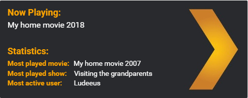



This card uses these elements that you also need to install:

* [sensor.tautilli](https://github.com/custom-components/sensor.tautulli)
* [state-attribute-element](https://github.com/custom-cards/state-attribute-element)
* [text-element](https://github.com/custom-cards/text-element)







```yaml
resources:
  - url: /local/state-attribute-element.js?v=0
    type: js
  - url: /local/text-element.js?v=0
    type: js
title: Home Assistant
views:
  - title: Tautulli card
    icon: mdi:plex
    cards:
      - type: picture-elements
        image: /local/plex.jpg
        elements:
          - type: custom:text-element
            text: "<b style='color: orange; font-size: 18px'>Now Playing: </b>"
            style:
              top: 7%
              left: 15px
              transform: none
          - type: custom:state-attribute-element
            entity: sensor.tautulli
            attribute: 'Ludeeus'
            sub_attribute: 'magic_title'
            show_empty: false
            style:
              top: 20%
              left: 15px
              font-size: 16px
              color: white
              transform: none
          - type: custom:text-element
            text: "<b style='color: orange; font-size: 18px'>Statistics: </b>"
            style:
              top: 47%
              left: 15px
              transform: none
          - type: custom:state-attribute-element
            entity: sensor.tautulli
            attribute: "Top Movie"
            show_empty: true
            prefix: "<b style='color: orange; margin-right: 5px'>Most played movie: </b>"
            style:
              top: 60%
              left: 15px
              color: white
              transform: none
          - type: custom:state-attribute-element
            entity: sensor.tautulli
            attribute: "Top TV Show"
            show_empty: true
            prefix: "<b style='color: orange; margin-right: 11px'>Most played show: </b>"
            style:
              top: 70%
              left: 15px
              color: white
              transform: none
          - type: custom:state-attribute-element
            entity: sensor.tautulli
            attribute: "Top User"
            show_empty: true
            prefix: "<b style='color: orange; margin-right: 20px'>Most active user: </b>"
            style:
              top: 80%
              left: 15px
              color: white
              transform: none
```



