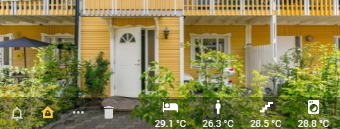


Remember to change the sensor entities for your own.

To get the grey transparent area known from the picture glance on my background, I first created it as a picture glance and took a screenshot that I can use for my "glance".




```yaml
title: Home Assistant
views:
  - type: picture-elements
          image: /local/house-element.jpg
          elements:
            - type: state-icon
              entity: alarm_control_panel.home_alarm
              style:
                top: 87%
                left: 5%
                color: white
            - type: state-icon
              entity: sensor.front_door_combined
              style:
                top: 86%
                left: 14%
                color: white
            - type: state-icon
              entity: sensor.mailbox
              style:
                top: 86%
                left: 23%
                color: white
            - type: state-icon
              entity: sensor.trash_bin
              style:
                top: 86%
                left: 32%
                color: white

            ## temp
            - type: icon
              icon: mdi:hotel
              entity: sensor.temperature_bedroom
              tap_action: more-info
              style:
                top: 82%
                left: 50%              
                color: white
            - type: state-label
              entity: sensor.temperature_bedroom
              style:
                top: 95%
                left: 50%
                color: white

            - type: icon
              icon: mdi:human-male
              entity: sensor.temperature_stefan
              tap_action: more-info
              style:
                top: 82%
                left: 64% 
                color: white
            - type: state-label
              entity: sensor.temperature_stefan
              style:
                top: 95%
                left: 64%
                color: white

            - type: icon
              icon: mdi:stairs
              entity: sensor.temperature_passage
              tap_action: more-info
              style:
                top: 82%
                left: 78% 
                color: white
            - type: state-label
              entity: sensor.temperature_passage
              style:
                top: 95%
                left: 78%
                color: white

            - type: icon
              icon: mdi:washing-machine
              entity: sensor.temperature_downstairs_bathroom
              tap_action: more-info
              style:
                top: 82%
                left: 92% 
                color: white
            - type: state-label
              entity: sensor.temperature_downstairs_bathroom
              style:
                top: 95%
                left: 92%
                color: white
```



