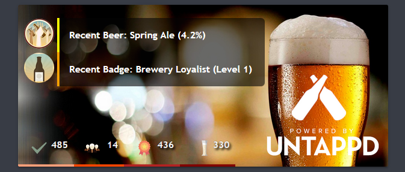

This card requires you to install and setup the following components:



* [Untapped](https://github.com/custom-components/sensor.untapped)



```yaml
    - type: picture-elements
      image: /local/cards/untappd.png
      elements:
      - type: state-icon
        entity: sensor.untappd_last_checkin
        style:
          top: 18px
          left: 8px
          transform: none
      - type: state-label
        entity: sensor.untappd_beer
        style:
          top: 8%
          left: 52px
          transform: none
          color: rgb(255, 255, 255)
          font-family: Trebuchet MS
          font-size: 90%
          font-weight: bold
          border-left-style: solid
          border-color: Yellow
          background-color: rgb(4, 4, 4, 0.6)
          pointer-events: none
          width: 263px
          padding: 5px
          border-top-right-radius: 5px
      - type: state-icon
        entity: sensor.untappd_last_badge
        style:
          top: 64px
          left: 8px
          transform: none
      - type: state-label
        entity: sensor.untappd_badge
        style:
          top: 63px
          left: 52px
          transform: none
          color: rgb(255, 255, 255)
          font-family: Trebuchet MS
          font-size: 90%
          font-weight: bold
          border-left-style: solid
          border-color: Orange
          background-color: rgb(4, 4, 4, 0.6)
          pointer-events: none
          width: 263px
          padding: 5px
          border-bottom-right-radius: 5px

      - type: state-icon
        entity: sensor.untappd_checked
        style:
          bottom: 0px
          left: 8px
          transform: none
          z-index: 2
      - type: state-label
        entity: sensor.untappd_checked
        style:
          bottom: 0px
          left: 0px
          transform: none
          color: rgb(255, 255, 255)
          -webkit-text-stroke: 0.2px rgb(0, 0, 0, 0.6)
          text-shadow: 0.1px 0.1px rgb(0, 0, 0, 0.6)
          font-family: Trebuchet MS
          font-size: 90%
          font-weight: bold
          border-bottom-style: solid
          border-color: LightSalmon
          padding-left: 36px
          padding-bottom: 8px
          text-shadow: 2px 2px 2px black

      - type: state-icon
        entity: sensor.untappd_followings
        style:
          bottom: 0px
          left: 78px
          transform: none
          z-index: 2
      - type: state-label
        entity: sensor.untappd_followings
        style:
          bottom: 0px
          left: 74px
          transform: none
          color: rgb(255, 255, 255)
          -webkit-text-stroke: 0.2px rgb(0, 0, 0, 0.6)
          text-shadow: 0.1px 0.1px rgb(0, 0, 0, 0.6)
          font-family: Trebuchet MS
          font-size: 90%
          font-weight: bold
          border-bottom-style: solid
          border-color: OrangeRed
          padding-left: 36px
          padding-bottom: 8px
          text-shadow: 2px 2px 2px black

      - type: state-icon
        entity: sensor.untappd_total_badges
        style:
          bottom: 0px
          left: 148px
          transform: none
          z-index: 2
      - type: state-label
        entity: sensor.untappd_total_badges
        style:
          bottom: 0px
          left: 141px
          transform: none
          color: rgb(255, 255, 255)
          -webkit-text-stroke: 0.2px rgb(0, 0, 0, 0.6)
          text-shadow: 0.1px 0.1px rgb(0, 0, 0, 0.6)
          font-family: Trebuchet MS
          font-size: 90%
          font-weight: bold
          border-bottom-style: solid
          border-color: FireBrick
          padding-left: 36px
          padding-bottom: 8px
          text-shadow: 2px 2px 2px black

      - type: state-icon
        entity: sensor.untappd_total_beers
        style:
          bottom: 0px
          left: 228px
          transform: none
          z-index: 2
      - type: state-label
        entity: sensor.untappd_total_beers
        style:
          bottom: 0px
          left: 215px
          transform: none
          color: rgb(255, 255, 255)
          -webkit-text-stroke: 0.2px rgb(0, 0, 0, 0.6)
          text-shadow: 0.1px 0.1px rgb(0, 0, 0, 0.6)
          font-family: Trebuchet MS
          font-size: 90%
          font-weight: bold
          border-bottom-style: solid
          border-color: Maroon    
          padding-left: 36px
          padding-bottom: 8px
          text-shadow: 2px 2px 2px black
```

And then some templating to get it too look the way it is on the picture, so here are the sensors

```yaml
  - platform: template
    sensors:
      untappd_badge:
       value_template: "Recent Badge: {{ states.sensor.untappd_last_badge.attributes.badge }} (Level {{ states.sensor.untappd_last_badge.attributes.level }})"

  - platform: template
    sensors:
      untappd_beer:
       value_template: "Recent Beer: {{ states.sensor.untappd_last_checkin.attributes.beer }} ({{ states.sensor.untappd_last_checkin.attributes.abv }})"

  - platform: template
    sensors:
      untappd_followings:
       unit_of_measurement: followers
       value_template: "{{ states.sensor.untappd_last_checkin.attributes.followings }}"

  - platform: template
    sensors:
      untappd_checked:
       unit_of_measurement: checkins
       value_template: "{{ states.sensor.untappd_last_checkin.attributes.checkins }}"

  - platform: template
    sensors:
      untappd_total_beers:
       unit_of_measurement: beers
       value_template: "{{ states.sensor.untappd_last_checkin.attributes.total_beers }}"

  - platform: template
    sensors:
      untappd_total_badges:
       unit_of_measurement: badges
       value_template: "{{ states.sensor.untappd_last_checkin.attributes.total_badges }}"
```

The icons are from [loading.io](https://loading.io/) and the background image isn't available for reuse so make your own.
