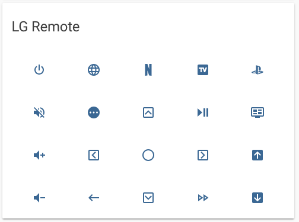

This card requires you to install and setup the following components:



* [Logitech Harmony](https://www.home-assistant.io/components/remote.harmony/)



Once harmony is set up, open [HUB_NAME].conf (located at the root of your config folder). Here you will find a listing of all the devices and the commands they can issue.
Each device starts with something like: `53209424 - LG TV`. The number on the left is the device code for that device. You will utilize `tap_action` to send the command.
A service block looks like this:

```yaml
    service_data:
      "entity_id": "remote.joehubz"
      "device": "53209424"
      "command": "Mute"
```

Swap your device code and command name to customize for your AV setup.

Finally, switch out the entity for some dormant binary sensor in your system. In the example below, I used my front_door sensor.


Change the icons and device codes to your own.




If you are still able to "Configure UI" you can drop the code into a new card. If you have taken full manual control, you can !include the remote file. (shown below) 




```yaml
# if you have taken manual control
      - type: glance
        cards: !include remotes/lg.yaml
```





```yaml

type: glance
title: LG Remote
show_state: false
entities:

  # power row
  - entity: binary_sensor.front_door
    icon: mdi:power
    name: ' ' 
    tap_action:
      action: call-service
      service: media_player.toggle
      service_data:
        entity_id: media_player.lg_tv
  - entity: binary_sensor.front_door
    icon: mdi:web
    name: ' ' 
    tap_action:
      action: call-service
      service: media_player.select_source
      service_data:
        entity_id: media_player.lg_tv
      source: "Web Browser"
  - entity: binary_sensor.front_door
    icon: mdi:netflix
    name: ' ' 
    tap_action:
      action: call-service
      service: media_player.select_source
      service_data:
        entity_id: media_player.lg_tv
        source: "Netflix"
  - entity: binary_sensor.front_door
    icon: mdi:television-box
    name: ' ' 
    tap_action:
      action: call-service
      service: media_player.select_source
      service_data:
        entity_id: media_player.lg_tv
        source: "Tivo"
  - entity: binary_sensor.front_door
    icon: mdi:playstation
    name: ' ' 
    tap_action:
      action: call-service
      service: media_player.select_source
      service_data:
        entity_id: media_player.lg_tv
        source: "Onkyo"


  # top row
  - entity: binary_sensor.front_door
    icon: mdi:volume-off
    name: ' ' 
    tap_action:
      action: call-service
      service: remote.send_command
      service_data:
        "entity_id": "remote.joehubz"
        "device": "53209424"
        "command": "Mute"
  - entity: binary_sensor.front_door
    icon: mdi:home
    name: ' ' 
    tap_action:
      action: call-service
      service: remote.send_command
      service_data:
        "entity_id": "remote.joehubz"
        "device": "59364597"
        "command": "Home"
  - entity: binary_sensor.front_door
    icon: mdi:chevron-up-box-outline
    name: ' ' 
    tap_action:
      action: call-service
      service: remote.send_command
      service_data:
        "entity_id": "remote.joehubz"
        "device": "53209424"
        "command": "DirectionUp"
  - entity: binary_sensor.front_door
    icon: mdi:play-pause
    name: ' ' 
    tap_action:
      action: call-service
      service: remote.send_command
      service_data:
        "entity_id": "remote.joehubz"
        "device": "53209424"
        "command": "Pause"
  - entity: binary_sensor.front_door
    icon: mdi:stop
    name: ' '
    tap_action:
      action: call-service
      service: remote.send_command
      service_data:
        "entity_id": "remote.joehubz"
        "device": "59364597"
        "command": "Stop"


    # middle row
  - entity: binary_sensor.front_door
    icon: mdi:volume-plus
    name: ' ' 
    tap_action:
      action: call-service
      service: media_player.volume_up
      service_data:
        entity_id: media_player.lg_tv
  - entity: binary_sensor.front_door
    icon: mdi:chevron-left-box-outline
    name: ' ' 
    tap_action:
      action: call-service
      service: remote.send_command
      service_data:
        "entity_id": "remote.joehubz"
        "device": "53209424"
        "command": "DirectionLeft"
  - entity: binary_sensor.front_door
    icon: mdi:checkbox-blank-circle-outline
    name: ' ' 
    tap_action:
      action: call-service
      service: remote.send_command
      service_data:
        "entity_id": "remote.joehubz"
        "device": "53209424"
        "command": "OK"
  - entity: binary_sensor.front_door
    icon: mdi:chevron-right-box-outline
    name: ' ' 
    tap_action:
      action: call-service
      service: remote.send_command
      service_data:
        "entity_id": "remote.joehubz"
        "device": "53209424"
        "command": "DirectionRight"
  - entity: binary_sensor.front_door
    icon: mdi:rewind
    name: ' '
    tap_action:
      action: call-service
      service: remote.send_command
      service_data:
        entity_id: remote.joehubz
        device: '59364597'
        command: Rewind


  # bottom row
  - entity: binary_sensor.front_door
    icon: mdi:volume-minus
    name: ' ' 
    tap_action:
      action: call-service
      service: media_player.volume_down
      service_data:
        entity_id: media_player.lg_tv
  - entity: binary_sensor.front_door
    icon: mdi:undo
    name: ' '
    tap_action:
      action: call-service
      service: remote.send_command
      service_data:
        entity_id: "remote.joehubz"
        device: "59364597"
        command: "Back"
  - entity: binary_sensor.front_door
    icon: mdi:chevron-down-box-outline
    name: ' ' 
    tap_action:
      action: call-service
      service: remote.send_command
      service_data:
        "entity_id": "remote.joehubz"
        "device": "53209424"
        "command": "DirectionDown"
  - entity: binary_sensor.front_door
    icon: mdi:redo
    name: ' '
    tap_action:
      action: call-service
      service: remote.send_command
      service_data:
        "entity_id": "remote.joehubz"
        "device": "59364597"
        "command": "SkipForward"
  - entity: binary_sensor.front_door
    icon: mdi:fast-forward
    name: ' '
    tap_action:
      action: call-service
      service: remote.send_command
      service_data:
        "entity_id": "remote.joehubz"
        "device": "59364597"
        "command": "FastForward"


```


